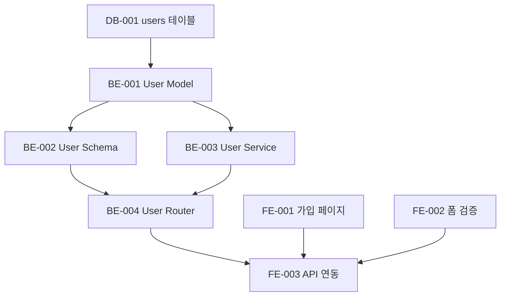

# Step 4: 작업 분해 (Stories)

## 단계 정보
- **단계**: 4/10 - 작업 분해
- **스킬**: `dev-product_manager`
- **입력**: `docs/prd.md`, `docs/architecture.md`
- **산출물**: `docs/stories.md`

---

## 실행 단계

### 1. 컨텍스트 로드

다음 파일을 읽고 분석합니다:
- `docs/prd.md` - 사용자 스토리 및 수락 기준
- `docs/architecture.md` - 기술 아키텍처 및 API 설계

### 2. 스킬 로드

`dev-product_manager` 스킬을 로드합니다.

### 3. Epic 분해

사용자 스토리를 기능 모듈별로 그룹화하여 Epic으로 나눕니다:

```
Epic: 사용자 관리
├── US-001: 사용자 가입
├── US-002: 사용자 로그인
├── US-003: 비밀번호 초기화
└── US-004: 프로필

Epic: 주문 관리
├── US-010: 주문 생성
├── US-011: 주문 리스트
└── US-012: 주문 상세
```

### 4. Story 분할

각 User Story를 기술적 Story로 분할합니다:

```
US-001: 사용자 가입
├── [DB-001] users 테이블 생성
├── [BE-001] User Model 구현
├── [BE-002] User Schema 구현
├── [BE-003] User Service 구현
├── [BE-004] User Router 구현 - POST /register
├── [FE-001] 가입 페이지 컴포넌트 구현
├── [FE-002] 폼 검증 구현
├── [FE-003] API 연동
└── [TEST-001] 가입 기능 테스트
```

### 5. Story 형식

각 Story는 다음 내용을 포함합니다:

```markdown
## [BE-001] User Model

**유형**: Backend
**Epic**: 사용자 관리
**User Story**: US-001 사용자 가입
**우선순위**: P0
**예상 시간**: 2h

### 설명
기본 필드와 관계를 포함하는 사용자 데이터 모델을 생성합니다.

### 수락 기준
- [ ] `models/user.py` 생성
- [ ] 필드 포함: id, email, password_hash, name, created_at, updated_at
- [ ] 인덱스 정의: email (unique)
- [ ] Model 확인 스크립트 통과

### 의존성
- [DB-001] users 테이블이 생성되어 있어야 함

### 파일
- `src/backend/models/user.py`

### 확인 명령어
```bash
python scripts/check-model.py --file src/backend/models/user.py
```
```

### 6. 의존성 관계

Story 간의 의존성을 설정합니다:



### 7. 문서 생성

`docs/stories.md`를 생성합니다:

```markdown
# {프로젝트 이름} - 개발 작업 리스트

## 개요
- Epic 수: {epic_count}
- Story 총수: {story_count}
- 예상 총 공수: {total_hours}h

## Epic 리스트

### Epic 1: 사용자 관리
| ID | 제목 | 유형 | 우선순위 | 예상 | 상태 |
|----|------|------|--------|------|------|
| DB-001 | users 테이블 | Database | P0 | 1h | 대기 중 |
| BE-001 | User Model | Backend | P0 | 2h | 대기 중 |
| ... | ... | ... | ... | ... | ... |

### Epic 2: ...

## Story 상세
### [DB-001] users 테이블
...

### [BE-001] User Model
...

## 의존성 그래프

## Sprint 계획 제안
### Sprint 1 (Week 1-2)
- 데이터베이스 설계
- 기초 Model 계층 구현
- 핵심 API 구현

### Sprint 2 (Week 3-4)
- 비즈니스 로직 구현
- 프론트엔드 페이지 구현
- 통합 테스트 실행
```

### 8. 사용자 확인

작업 리스트를 사용자에게 보여주고 확인을 요청합니다:

```
[C] 확인 - 작업 분해 완료, 다음 단계로 진행
[E] 편집 - Story 수정
[A] 추가 - 새로운 Story 추가
[R] 재정렬 - 우선순위 또는 의존성 조정
```

---

## 완료 확인

- [ ] `docs/stories.md` 생성됨
- [ ] 모든 User Story가 분할됨
- [ ] 각 Story에 명확한 수락 기준이 있음
- [ ] 의존성 관계가 정의됨
- [ ] 사용자가 최종 확인함

## 상태 업데이트

```yaml
phases:
  stories:
    status: completed
    completed_at: {current_time}
    stats:
      epic_count: {n}
      story_count: {n}
      total_hours: {n}
```

## 다음 단계

→ `step-05-database.md`로 진입
