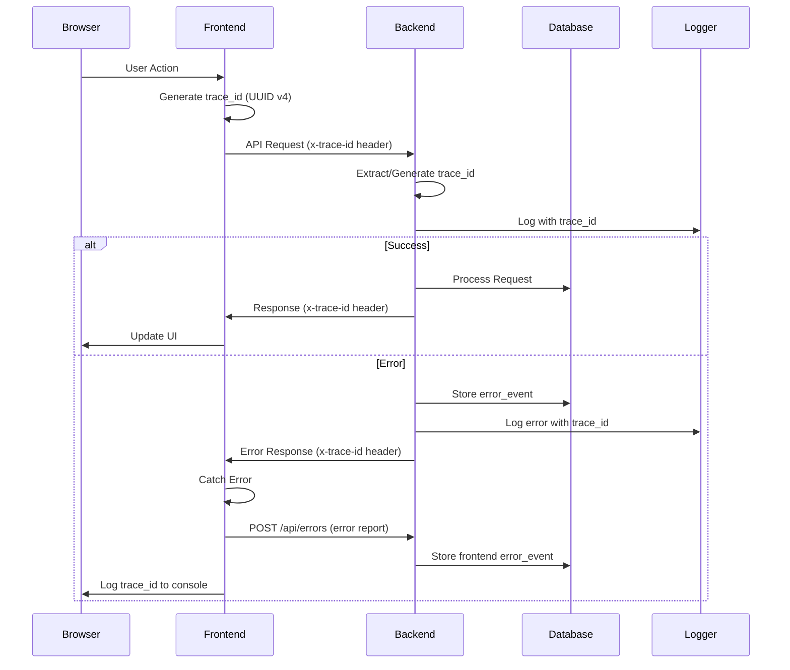
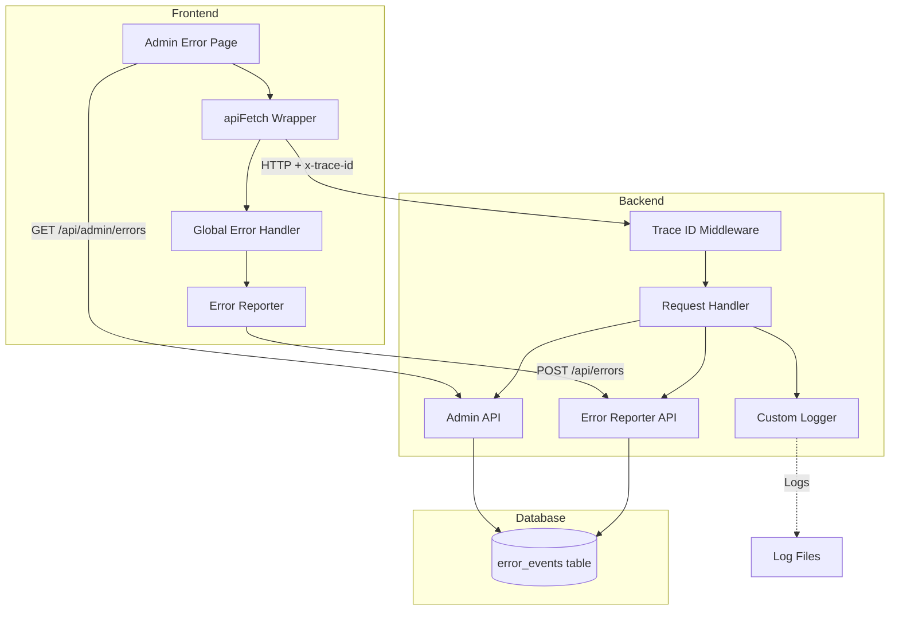

# Design Document: Error Tracking System

## Overview

The error tracking system provides end-to-end error correlation between frontend and backend using unique trace IDs (UUID v4). The system consists of three main components:

1. **Trace ID Middleware** - Generates and propagates trace IDs across request/response cycles
2. **Error Storage and Reporting** - Captures and persists error events with full context
3. **Admin Monitoring Interface** - Provides visibility into errors with search and filtering capabilities

The design follows the existing project architecture with Flask backend, React frontend, and Supabase database. All components integrate seamlessly with the current authentication and authorization system.

## Architecture

### System Flow



### Component Architecture



## Components and Interfaces

### Backend Components

#### 1. Trace ID Middleware (Flask Before/After Request)

**Location:** `backend/common/trace_middleware.py`

**Purpose:** Generate or extract trace IDs and attach them to request context

**Interface:**
```python
def setup_trace_middleware(app: Flask) -> None:
    """Register trace ID middleware with Flask app"""
    
@app.before_request
def before_request_trace() -> None:
    """Extract or generate trace_id and store in g.trace_id"""
    
@app.after_request
def after_request_trace(response: Response) -> Response:
    """Add x-trace-id header to response"""
```

**Implementation Details:**
- Use `flask.g.trace_id` to store trace ID for request duration
- Check `request.headers.get('x-trace-id')` first
- Generate new UUID v4 if not provided: `str(uuid.uuid4())`
- Add `response.headers['x-trace-id'] = g.trace_id`
- Handle cases where g.trace_id might not be set (use "NO_TRACE")

#### 2. Custom Logger Formatter

**Location:** `backend/common/logger.py`

**Purpose:** Format log messages to include trace IDs

**Interface:**
```python
class TraceIDFormatter(logging.Formatter):
    """Custom formatter that includes trace_id in log messages"""
    
    def format(self, record: logging.LogRecord) -> str:
        """Format log record with trace_id"""

def setup_logging(app: Flask) -> None:
    """Configure application logging with trace ID support"""
```

**Implementation Details:**
- Format: `[%(asctime)s] [%(levelname)s] [%(trace_id)s] [%(name)s] %(message)s`
- Get trace_id from `flask.g.trace_id` or use "NO_TRACE"
- Add trace_id to LogRecord before formatting
- Configure root logger and app logger

#### 3. Error Events Storage

**Location:** `doc/supabase-schema.sql` (schema), `backend/modules/errors/service.py` (access)

**Database Schema:**
```sql
CREATE TABLE error_events (
    id UUID PRIMARY KEY DEFAULT gen_random_uuid(),
    trace_id UUID NOT NULL,
    where_from VARCHAR(20) NOT NULL CHECK (where_from IN ('frontend', 'backend')),
    message VARCHAR(1000) NOT NULL,
    detail JSONB,
    created_at TIMESTAMP WITH TIME ZONE DEFAULT NOW()
);

CREATE INDEX idx_error_events_trace_id ON error_events(trace_id);
CREATE INDEX idx_error_events_created_at ON error_events(created_at DESC);
```

**Service Interface:**
```python
def create_error_event(
    trace_id: str,
    where_from: str,
    message: str,
    detail: dict
) -> dict:
    """Store error event in database"""

def get_error_events(
    page: int = 1,
    page_size: int = 100,
    where_from: Optional[str] = None,
    start_date: Optional[datetime] = None,
    end_date: Optional[datetime] = None
) -> dict:
    """Retrieve paginated error events"""

def get_error_events_by_trace_id(trace_id: str) -> list[dict]:
    """Retrieve all error events for a specific trace_id"""
```

#### 4. Error Reporting API

**Location:** `backend/modules/errors/router.py`

**Endpoints:**
```python
@router.post('/api/errors')
def report_error(error_data: ErrorReportDTO) -> Response:
    """Accept error reports from frontend"""

@router.get('/api/admin/errors')
@require_admin
def list_errors(
    page: int = 1,
    page_size: int = 100,
    where_from: Optional[str] = None,
    start_date: Optional[str] = None,
    end_date: Optional[str] = None
) -> Response:
    """List recent errors with pagination and filters"""

@router.get('/api/admin/errors/<trace_id>')
@require_admin
def get_error_by_trace_id(trace_id: str) -> Response:
    """Get all logs for specific trace_id"""

@router.post('/api/admin/errors/test')
@require_admin
def trigger_test_error() -> Response:
    """Trigger intentional 500 error for testing"""
```

**DTOs:**
```python
class ErrorReportDTO(BaseModel):
    trace_id: str
    message: str
    stack_trace: Optional[str] = None
    user_context: Optional[dict] = None
    url: Optional[str] = None
    user_agent: Optional[str] = None
```

### Frontend Components

#### 1. API Wrapper with Trace ID

**Location:** `frontend/src/common/api.ts`

**Interface:**
```typescript
interface ApiFetchOptions extends RequestInit {
  skipTraceId?: boolean;
}

interface ApiFetchResponse<T = any> {
  data: T;
  traceId: string;
  status: number;
}

async function apiFetch<T = any>(
  url: string,
  options?: ApiFetchOptions
): Promise<ApiFetchResponse<T>>
```

**Implementation Details:**
- Generate trace_id: `crypto.randomUUID()`
- Add to headers: `{ 'x-trace-id': traceId }`
- Extract from response: `response.headers.get('x-trace-id')`
- Wrap existing fetch calls
- Handle errors and preserve trace_id
- Return both data and traceId

#### 2. Global Error Handler

**Location:** `frontend/src/common/errorHandler.ts`

**Interface:**
```typescript
interface ErrorReport {
  traceId: string;
  message: string;
  stackTrace?: string;
  userContext?: Record<string, any>;
  url?: string;
  userAgent?: string;
}

function setupGlobalErrorHandler(): void
function reportError(error: Error, traceId?: string): Promise<void>
```

**Implementation Details:**
- Listen to `window.onerror` and `window.onunhandledrejection`
- Extract error details (message, stack, url)
- Get user context (user_id from auth store)
- Call `POST /api/errors` with error report
- Log trace_id to console: `console.error('[TRACE_ID]', traceId)`
- Handle API errors gracefully (don't create error loops)

#### 3. Admin Error Monitoring Page

**Location:** `frontend/src/modules/admin/views/ErrorMonitoringView.tsx`

**Components:**
- `ErrorTable` - Display error list with columns: timestamp, trace_id, where_from, message
- `ErrorDetailModal` - Show all logs for selected trace_id
- `ErrorFilters` - Date range, source filter, trace_id search
- `TestErrorButton` - Trigger test error

**Interface:**
```typescript
interface ErrorEvent {
  id: string;
  traceId: string;
  whereFrom: 'frontend' | 'backend';
  message: string;
  detail: Record<string, any>;
  createdAt: string;
}

interface ErrorFilters {
  whereFrom?: 'frontend' | 'backend';
  startDate?: string;
  endDate?: string;
  traceId?: string;
}
```

**Hooks:**
```typescript
function useErrorEvents(
  page: number,
  filters: ErrorFilters
): {
  errors: ErrorEvent[];
  total: number;
  loading: boolean;
  error: Error | null;
}

function useErrorByTraceId(traceId: string): {
  events: ErrorEvent[];
  loading: boolean;
  error: Error | null;
}
```

## Data Models

### Error Event Model

```typescript
// Frontend
interface ErrorEvent {
  id: string;
  traceId: string;
  whereFrom: 'frontend' | 'backend';
  message: string;
  detail: {
    stackTrace?: string;
    userContext?: {
      userId?: string;
      userAgent?: string;
      url?: string;
    };
    requestData?: any;
    responseData?: any;
  };
  createdAt: string;
}
```

```python
# Backend
class ErrorEventDTO(BaseModel):
    id: str
    trace_id: str
    where_from: str
    message: str
    detail: dict
    created_at: datetime
```

### Trace ID Format

- **Type:** UUID v4
- **Format:** `xxxxxxxx-xxxx-4xxx-yxxx-xxxxxxxxxxxx`
- **Example:** `550e8400-e29b-41d4-a716-446655440000`
- **Generation:** `crypto.randomUUID()` (frontend), `uuid.uuid4()` (backend)

## Correctness Properties

*A property is a characteristic or behavior that should hold true across all valid executions of a system—essentially, a formal statement about what the system should do. Properties serve as the bridge between human-readable specifications and machine-verifiable correctness guarantees.*

### Property 1: Trace ID Generation and Preservation

*For any* backend request, if no x-trace-id header is provided, a valid UUID v4 trace ID should be generated; if an x-trace-id header is provided, that trace ID should be preserved and used throughout the request lifecycle.

**Validates: Requirements 1.1, 1.2, 1.3**

### Property 2: Trace ID Response Header Propagation

*For any* backend response, the x-trace-id header should be present and contain the same trace ID that was used during request processing.

**Validates: Requirements 1.4**

### Property 3: Frontend Trace ID Generation

*For any* API request made through apiFetch, a valid UUID v4 trace ID should be generated and included in the x-trace-id request header.

**Validates: Requirements 1.5, 6.2, 6.3**

### Property 4: Frontend Trace ID Extraction

*For any* API response received through apiFetch, the trace ID should be extracted from the x-trace-id response header and returned to the caller.

**Validates: Requirements 1.6, 6.4**

### Property 5: Trace ID Preservation in Error Handling

*For any* error encountered by apiFetch, the associated trace ID should be preserved and available for error reporting.

**Validates: Requirements 6.5**

### Property 6: Log Entry Format with Trace ID

*For any* log message generated by the backend, the formatted output should include the trace ID in the format: [timestamp] [level] [trace_id] [module] message.

**Validates: Requirements 2.1, 2.2**

### Property 7: Error Detail Size Limit

*For any* error event with detail exceeding 10KB, the system should truncate the detail and add a truncation indicator.

**Validates: Requirements 3.3, 10.1**

### Property 8: Where From Validation

*For any* error event creation attempt with where_from value other than "frontend" or "backend", the system should reject the request.

**Validates: Requirements 3.4**

### Property 9: Automatic Timestamp Assignment

*For any* error event stored in the database, the created_at field should be automatically set to the current timestamp.

**Validates: Requirements 3.5**

### Property 10: Error Report Storage with Correct Source

*For any* error report received at POST /api/errors, the system should store it in error_events table with where_from set to "frontend".

**Validates: Requirements 4.3**

### Property 11: Error Report Success Response

*For any* valid error report submitted to POST /api/errors, the system should return a 201 status code.

**Validates: Requirements 4.4**

### Property 12: Error Report Validation Failure Response

*For any* invalid error report submitted to POST /api/errors, the system should return a 400 status code with error details.

**Validates: Requirements 4.5**

### Property 13: Admin Endpoint Authentication

*For any* request to /api/admin/errors endpoints without valid authentication, the system should return a 401 status code.

**Validates: Requirements 5.3, 11.1, 11.5**

### Property 14: Admin Endpoint Authorization

*For any* authenticated request to /api/admin/errors endpoints from a non-admin user, the system should return a 403 status code.

**Validates: Requirements 5.4, 11.2, 11.5**

### Property 15: Error List Pagination

*For any* request to GET /api/admin/errors with page and page_size parameters, the system should return the correct subset of errors based on pagination.

**Validates: Requirements 5.5**

### Property 16: Error List Sort Order

*For any* request to GET /api/admin/errors, the returned errors should be ordered by created_at in descending order (most recent first).

**Validates: Requirements 5.6**

### Property 17: Global Error Handler Reporting

*For any* unhandled error caught by the global error handler, an error report should be sent to POST /api/errors with the error message, stack trace, and user context.

**Validates: Requirements 7.2, 7.5**

### Property 18: Error Handler Trace ID Inclusion

*For any* API error caught by the error handler, the associated trace ID should be included in the error report sent to the backend.

**Validates: Requirements 7.3**

### Property 19: Error Handler Console Logging

*For any* error caught by the error handler, the trace ID should be logged to the browser console.

**Validates: Requirements 7.4**

### Property 20: Non-Admin Access Redirect

*For any* non-admin user attempting to access the admin error monitoring page, the system should redirect to the home page.

**Validates: Requirements 8.7, 11.3**

### Property 21: Trace ID Format Validation

*For any* trace ID stored in the system, it should be in valid UUID format (36 characters with hyphens).

**Validates: Requirements 10.2**

### Property 22: Error Message Length Limit

*For any* error message exceeding 1000 characters, the system should truncate it and add an ellipsis.

**Validates: Requirements 10.3, 10.4**

### Property 23: Error Reporting Authentication

*For any* request to POST /api/errors without valid authentication, the system should return a 401 status code.

**Validates: Requirements 11.4**

## Error Handling

### Backend Error Handling

1. **Middleware Errors**
   - If trace ID generation fails, use "ERROR_TRACE" as fallback
   - Log middleware errors but don't block requests
   - Always return a trace ID in response header

2. **Database Errors**
   - Catch database connection errors and return 503 Service Unavailable
   - Log full error details with trace ID
   - Return user-friendly error message

3. **Validation Errors**
   - Return 400 Bad Request with specific validation errors
   - Include trace ID in error response
   - Log validation failures for monitoring

4. **Authentication/Authorization Errors**
   - Return 401 for missing/invalid authentication
   - Return 403 for insufficient permissions
   - Include trace ID in error response
   - Don't expose sensitive auth details

### Frontend Error Handling

1. **API Errors**
   - Extract trace ID from error response
   - Display user-friendly error message
   - Log trace ID to console for debugging
   - Send error report to backend

2. **Network Errors**
   - Handle timeout and connection errors
   - Preserve trace ID from request
   - Show offline/network error message
   - Retry with exponential backoff (optional)

3. **Unhandled Errors**
   - Catch via global error handler
   - Generate trace ID if not available
   - Send error report to backend
   - Log to console with trace ID

4. **Error Reporting Failures**
   - Don't create error loops (catch errors in error reporter)
   - Log to console if backend reporting fails
   - Use try-catch around error reporting logic

## Testing Strategy

### Unit Tests

**Backend:**
- Test trace ID middleware with/without header
- Test logger formatter with/without trace ID
- Test error event creation with valid/invalid data
- Test error reporting endpoint validation
- Test admin endpoint authentication/authorization
- Test pagination logic
- Test truncation logic for large payloads

**Frontend:**
- Test apiFetch wrapper trace ID generation
- Test apiFetch header extraction
- Test error handler error report creation
- Test admin page access control
- Test error table rendering
- Test filter and search functionality

### Property-Based Tests

Each property test should run a minimum of 100 iterations with randomized inputs. Tests should be tagged with the format: **Feature: error-tracking, Property {number}: {property_text}**

**Backend Property Tests:**
1. **Property 1**: Generate random requests with/without trace ID headers, verify generation/preservation
2. **Property 2**: Generate random responses, verify trace ID header presence
3. **Property 6**: Generate random log messages, verify format matches pattern
4. **Property 7**: Generate random error details of various sizes, verify 10KB+ are truncated
5. **Property 8**: Generate random where_from values, verify only "frontend"/"backend" accepted
6. **Property 9**: Generate random error events, verify created_at is set
7. **Property 10**: Generate random error reports, verify where_from is "frontend"
8. **Property 11**: Generate random valid error reports, verify 201 response
9. **Property 12**: Generate random invalid error reports, verify 400 response
10. **Property 13**: Generate random unauthenticated requests to admin endpoints, verify 401
11. **Property 14**: Generate random non-admin requests to admin endpoints, verify 403
12. **Property 15**: Generate random page/page_size values, verify correct pagination
13. **Property 16**: Generate random error events, verify sort order
14. **Property 21**: Generate random trace IDs, verify UUID format
15. **Property 22**: Generate random long messages, verify truncation
16. **Property 23**: Generate random unauthenticated error reports, verify 401

**Frontend Property Tests:**
1. **Property 3**: Generate random API calls, verify trace ID generation and header inclusion
2. **Property 4**: Generate random API responses, verify trace ID extraction
3. **Property 5**: Generate random API errors, verify trace ID preservation
4. **Property 17**: Generate random unhandled errors, verify error reports sent
5. **Property 18**: Generate random API errors, verify trace ID in error report
6. **Property 19**: Generate random errors, verify console logging
7. **Property 20**: Generate random non-admin users, verify redirect

### Integration Tests

1. **End-to-End Trace ID Flow**
   - Make frontend API request
   - Verify trace ID in request header
   - Verify trace ID in backend logs
   - Verify trace ID in response header
   - Verify trace ID matches throughout

2. **Error Reporting Flow**
   - Trigger frontend error
   - Verify error report sent to backend
   - Verify error stored in database
   - Verify error appears in admin interface
   - Verify trace ID correlation

3. **Test Error Button**
   - Click test error button
   - Verify 500 error triggered
   - Verify trace ID in console
   - Verify trace ID in backend logs
   - Verify error in admin interface within 5 seconds

4. **Admin Access Control**
   - Test unauthenticated access (redirect to login)
   - Test non-admin access (redirect to home)
   - Test admin access (page loads)

### Manual Testing Checklist

- [ ] Verify trace IDs appear in browser console for all API requests
- [ ] Verify trace IDs appear in backend logs for all requests
- [ ] Trigger test error and verify end-to-end tracking
- [ ] Search for trace ID in admin interface and verify results
- [ ] Filter errors by date range and source
- [ ] Verify error detail modal shows complete information
- [ ] Test with very long error messages (1000+ characters)
- [ ] Test with large error details (10KB+)
- [ ] Verify non-admin users cannot access admin page
- [ ] Verify error reporting works for unhandled exceptions

