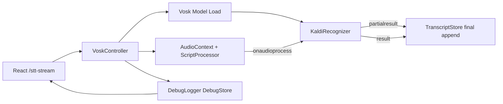

# Kiro Task Spec: Vosk-based Real-time STT

## Overview
Vosk 기반 브라우저 실시간 음성인식 (STT)
- 완전히 브라우저에서 실행 (서버 불필요)
- 실시간 partial result 지원 (단어 단위 즉시 표시)
- 오프라인 동작 가능 (모델 로드 후)
- 7개 언어 지원 (en, ko, zh, ja, es, fr, de)

## Goal
- vosk-browser 라이브러리를 사용한 로컬 STT
- Google 서버 의존성 제거 (Web Speech API 대체)
- 실시간 단어 표시 (partialresult 이벤트)
- 디버그 패널 제공
- 새 라우트: http://localhost:3000/stt-stream

## 1. Route (React)

- Path: /stt-stream
- Component: SttStreamWebSpeechPage

All code lives under:
src/stt_webspeech_stream

## 2. Folder Layout

```
src/stt_webspeech_stream
  ui/
    SttStreamWebSpeechPage.jsx   # 메인 페이지 컴포넌트
    SttStreamWebSpeechPage.css   # 스타일
    DebugPanel.jsx               # 디버그 로그 패널
  app/
    VoskController.js            # Vosk 음성인식 컨트롤러 (메인)
    WebSpeechController.js       # Web Speech API 컨트롤러 (레거시)
    WhisperController.js         # Whisper 컨트롤러 (대안)
    debugLogger.js               # 디버그 로깅 유틸리티
    normalize.js                 # 텍스트 정규화
    overlapMerge.js              # 중복 제거 병합
    idleRestart.js               # 유휴 재시작 관리
  store/
    TranscriptStore.js           # 트랜스크립트 상태 관리
    DebugStore.js                # 디버그 로그 상태 관리
```

## 3. High-level Flow



## 4. Key Features

### VoskController
- `loadModel()`: 언어별 모델 로드 (Vite 프록시 통해 CORS 우회)
- `start()`: 마이크 접근 및 녹음 시작
- `stop()`: 녹음 중지 및 리소스 정리
- `setLanguage()`: 언어 변경 (모델 재로드 필요)

### 지원 언어
- English (en)
- 한국어 (ko)
- 中文 (zh)
- 日本語 (ja)
- Español (es)
- Français (fr)
- Deutsch (de)

### 모델 URL (Vite 프록시)
모델은 alphacephei.com에서 다운로드되며, Vite 프록시를 통해 CORS 우회:
- `/vosk-models/vosk-model-small-en-us-0.15.zip`
- `/vosk-models/vosk-model-small-ko-0.22.zip`
- 등등...

## 5. Dependencies

### NPM Packages
- `vosk-browser`: WebAssembly 기반 Vosk 음성인식

### Vite Config (vite.config.js)
```javascript
proxy: {
  '/vosk-models': {
    target: 'https://alphacephei.com/vosk/models',
    changeOrigin: true,
    secure: true,
    rewrite: (path) => path.replace(/^\/vosk-models/, ''),
  },
}
```

## 6. Usage

1. 모델 로드 버튼 클릭 (첫 실행 시 ~50MB 다운로드)
2. 시작 버튼 클릭
3. 말하면 실시간으로 텍스트 표시
4. 중지 버튼으로 녹음 종료
5. 다운로드 버튼으로 텍스트 파일 저장

## 7. Notes

- 모델은 브라우저에 캐시되어 다음 실행 시 빠르게 로드
- 인터넷 연결 없이도 동작 (모델 로드 후)
- 언어 변경 시 해당 언어 모델을 새로 로드해야 함
