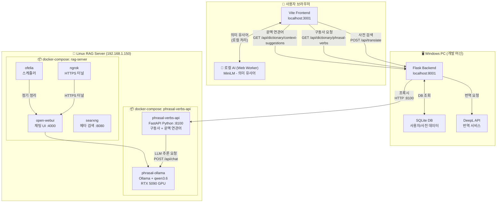
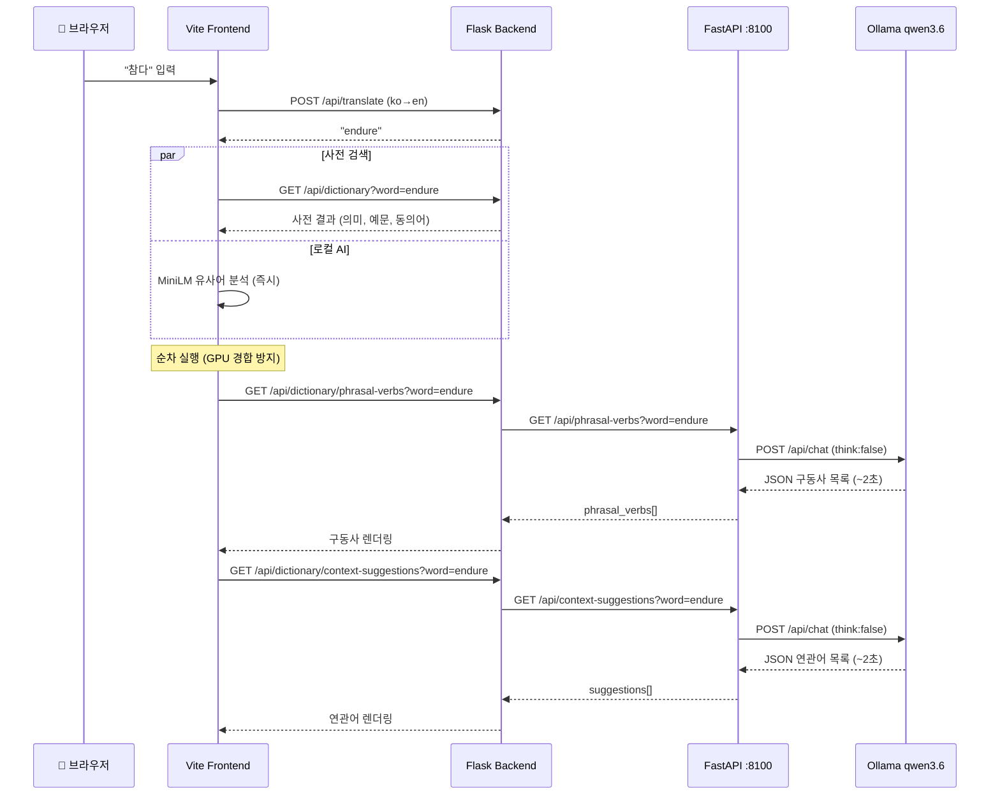

# UniLingo LLM Architecture

## 전체 아키텍처 다이어그램

## Docker 컨테이너 목록 (192.168.1.150)

### 📦 Compose 1: `phrasal-verbs-api` (`/home/lannie/phrasal-verbs-api/`)

| 컨테이너 | 이미지 | 포트 | 재시작 정책 | 역할 |
|---|---|---|---|---|
| `phrasal-ollama` | `ollama/ollama:latest` | 11434 | `always` | LLM 엔진 (qwen3.6, RTX 5090) |
| `phrasal-verbs-api` | `phrasal-verbs-api` (빌드) | 8100 | `always` | FastAPI 서버 — 구동사 + 문맥 연관어 생성 |

### 📦 Compose 2: `rag-server` (`/home/lannie/rag-server/`)

| 컨테이너 | 이미지 | 포트 | 재시작 정책 | 역할 |
|---|---|---|---|---|
| `open-webui` | `ghcr.io/open-webui/open-webui:main` | 4000 | `unless-stopped` | Ollama 채팅 웹 UI |
| `ngrok` | `ngrok/ngrok:latest` | 4040 | `unless-stopped` | 외부 HTTPS 접근 터널 |
| `searxng` | `searxng/searxng:latest` | 8080 | `unless-stopped` | 로컬 메타 검색 엔진 |
| `ofelia` | `mcuadros/ofelia:latest` | — | `unless-stopped` | 컨테이너 크론 스케줄러 |

## API 엔드포인트 (phrasal-verbs-api :8100)

| 엔드포인트 | 메서드 | 설명 |
|---|---|---|
| `/health` | GET | 서버 상태 + Ollama 연결 확인 |
| `/api/phrasal-verbs?word=endure&target_lang=ko` | GET | 영단어의 구동사/숙어 생성 (한글 번역 포함) |
| `/api/context-suggestions?word=endure` | GET | 문맥 연관어 생성 (한글 번역 포함) |
| `/api/cache` | DELETE | 인메모리 캐시 초기화 |

## 데이터 흐름 (사용자가 "endure" 검색 시)

## 서버 재부팅 시 자동 시작

- ✅ 모든 컨테이너 `restart: always` 또는 `unless-stopped` — **재부팅 시 자동 시작**
- ✅ `phrasal-ollama`가 healthy 상태가 될 때까지 `phrasal-verbs-api`는 대기 (`depends_on: condition: service_healthy`)
- ✅ Ollama 모델(qwen3.6)은 Docker volume(`rag-server_ollama_data`)에 영구 저장

> [!NOTE]
> `IPv4 forwarding is disabled` 경고가 나타나지만, 같은 Docker 네트워크 내 통신(`phrasal-verbs-api ↔ ollama`)에는 영향 없음.
> 외부 접근이 필요하면 `sysctl net.ipv4.ip_forward=1` 설정 필요.
